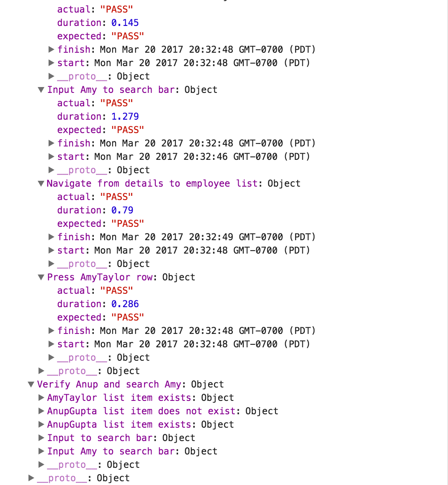

# Cavy-suites


**Cavy-suites** is a cross-platform integration test framework for React Native, forked from Cavy (by [Pixie Labs](http://pixielabs.io)) with additions by [TGPSKI](https://github.com/tgpski). Cavy-suites adds additional functionality to Cavy, including test suites, configurable logging, CI support, global test disable, and `react-redux` support. 

## How does it work?

Cavy (ab)uses React `ref` generating functions to reference and simulate actions upon deeply nested components in your
application. Unlike a tool like [enzyme](https://github.com/airbnb/enzyme)
which uses a simulated renderer, Cavy runs within your live application as it
is running on a host device (e.g. your Android or iOS simulator). This allows you to do far more accurate integration testing than if you run
your React app within a simulated rendering environment.

## Cavy-suites motivation

Cavy-suites introduces test suites, configurable logging, continuous integration support, global test disable, and `react-redux` support. 

### Specs vs. Suites

__Specs:__ reusable, parameterizable, oft-repeated actions (filling out a form with input variables, navigating from one page to the next)

In this `spec` function, we create a parameterized test which inputs arbitrary text into the SearchBar TextInput field.

```javascript
export function inputSearchBar(spec, text) {
  let description = `Input ${text} to search bar`;
  spec.describe(description, function() {
    spec.it('PASS', async function() {
      await spec.exists('SearchBar.TextInput');
      await spec.fillIn('SearchBar.TextInput', text);
      await spec.pause(1000);
    });
  });
}
```

__Suites:__ groups of parameterized specs that address separate parts of the app, while adhering to DRY

In this `suite` funciton, we create a test suite composed of parameterized test specs. Here, we use the inputSearchBar function with two different input variables.

```javascript
export const filterEmployeeList = (spec) => {
  spec.suite('Verify Anup and search Amy', () => {
    itSpec.presenceEmployeeListItem(spec, TEST_EMPLOYEE);
    itSpec.presenceEmployeeListItem(spec, TEST_EMPLOYEE2);
    itSpec.inputSearchBar(spec, SEARCH2);
    itSpec.notPresenceEmployeeListItem(spec, TEST_EMPLOYEE);
    itSpec.presenceEmployeeListItem(spec, TEST_EMPLOYEE2);
    itSpec.inputSearchBar(spec, ' ');
  });
};
```

### Configurable Logging

Cavy-suites adds the `consoleLog` prop to the Tester component. 

```
Optional/tristate: determine level of console feedback
                        false:     no console.log reporting
                        true:      some console.log reporting
                        'verbose': detailed console.log reporting, including test start/stop,
                         		     suite start/stop, and spec start/stop 
```




### Continuous Integration Support

Cavy-suites adds the `reporter` prop to the `Tester` component, as well as reporter functions which generate test reports in XUnit format. This allows developers to build Cavy-suites integration testing into their existing CI toolchain. 

Reports are generated in app in JSON format, then sent to a listening reporting server running on the CI node. Users can handle reporting in multiple ways (save to file, post test results). We currently use the reporting server to save the test report output to the server, and have Jenkins configured to wait for the presence / !presence of the test results file to post results.

### Global test disable

Using a Globals.js file, devs can create a global disable function that allows cavy-suite testing code to coexist with prod deployments. We use the `TEST_ENABLED` flag in three locations to support global test disable:

* Conditional assignments for testing variables in index.ios.js

```javascript
if (GLOBAL.TEST_ENABLED) {
  var testHookStore = new TestHookStore();
  var TestSuites = require('specs/itSuites.js');
  console.ignoredYellowBox = [''];
  var testSuitesArray = [TestSuites.filterEmployeeList, TestSuites.tapAndEmail];
  var testHookStore = new TestHookStore();
}
...
render() {
    if (GLOBAL.TEST_ENABLED) {
      return (
        <Provider store={store}>
          <Tester
            suites={testSuitesArray}
            store={testHookStore}
            waitTime={1000}
            testStartDelay={1000}
            consoleLog={true}
            reporter={true}
            reduxStore={store}
          >
            <EmployeeDirectoryApp />
          </Tester>
        </Provider>
      );
    } else {
      return (
        <Provider store={store}>
          <EmployeeDirectoryApp />
        </Provider>
      );
    }
  }
```

* Ternary operators in ref assignments 

```javascript
ref={GLOBAL.TEST_ENABLED ? this.props.generateTestHook('NavBar.LeftButton') : 'LeftButton'}
```

* Add enableTesting flags to hook and wrap methods, 
* Wrap returns hook(wrap(Component)) vs. mainline Cavy => wrap(Component)

```javascript
import { hook, wrap } from 'cavy';
...<MyStatelessComponent />
export const Stateless = wrap(MyStatelessComponent, GLOBAL.TEST_ENABLED);
```
### Redux integration

If you use Redux in your application, accessing state and dispatching actions in test suites/specs enables a host of new testing possibilities.

Cavy-suites includes [react-redux](https://github.com/reactjs/react-redux) integration, giving test specs access to `dispatch()` and `getState()` functions. Developers can create tests that compare the redux state to expected state during cavy integration tests.

Cavy-suites accepts the `reduxStore` prop to the Tester component, exposing 2 new spec helpers, `dispatchToStore(action)` and `getCurrentStore()`.

getCurrentStore is useful for comparing redux state to expected values after integration test actions.

dispatchToStore is useful for any middleware or other redux integrations that need actions dispatched to the app reducer. For example, we use `dispatchToStore(action)` with [redux-form](https://github.com/erikras/redux-form) to modify form values.

## Installation

To get started using Cavy-suites, install it using `yarn`:

    yarn add -D git://github.com/TGPSKI/cavy.git#cavy-suites

or `npm`:

    npm i --save-dev git://github.com/TGPSKI/cavy.git#cavy-suites

## Usage

Check out [the sample app](https://github.com/tgpski/cavy/tree/cavy-suites/sample-app/EmployeeDirectory) for example usage.

### Hook up components for testing

Add 'hooks' to any components you want to test by adding a `ref` and using the
`generateTestHook` function.

`generateTestHook` takes a string as its first argument - this is the identifier
to be used in tests. It takes an optional second argument in case you want to
set your own `ref` generating function.

Stateless functional components cannot be assigned a `ref` since they don't have
instances. Use the `wrap` function to wrap them inside a non-stateless component.

```javascript
import React, { Component } from 'react';
import { TextInput } from 'react-native';
import { FuncComponent } from 'somewhere';

import { hook } from 'cavy';

import GLOBAL from 'Helpers/Globals.js';

class Scene extends Component {
  render() {
    const WrappedComponent = wrap(FuncComponent);
    return (
      <View>
        <TextInput
          ref={GLOBAL.TEST_ENABLED ? 
          	this.props.generateTestHook('Scene.TextInput') : 
          	'Scene.TextInput'}
          onChangeText={...}
        />
        <WrappedComponent
          ref={GLOBAL.TEST_ENABLED ?
          	this.props.generateTestHook('Scene.Component') :
          	'Scene.Component'}
          onPress={...}
        />
      </View>      
    );
  }
}

const TestableScene = hook(Scene, GLOBAL.TEST_ENABLED);
export default TestableScene;
```

### Write your test specs

Using your component identifiers, write your spec functions. We suggest saving
these in a `cavy` folder in your app's top level directory - i.e. `./cavy/itSpecs.js`.

```javascript
export function navigateToEmployeeList(spec) {
  spec.describe('Navigate from details to employee list', function() {
    spec.it('PASS', async function() {
      await spec.exists('NavBar.LeftButton');
      await spec.press('NavBar.LeftButton');
      await spec.pause(500);
    });
  }); 
}

export function inputSearchBar(spec, text) {
  let description = `Input ${text} to search bar`;
  spec.describe(description, function() {
    spec.it('PASS', async function() {
      await spec.exists('SearchBar.TextInput');
      await spec.fillIn('SearchBar.TextInput', text);
      await spec.pause(1000);
    });
  });
}

export function inputSearchBarClear(spec) {
  spec.describe('Input text to search bar clear', function() {
    spec.it('PASS', async function() {
      await spec.fillIn('SearchBar.TextInput', ' ');
      await spec.pause(1000);
    });
  });
}
```

[See below](#available-spec-helpers) for a list of currently available spec
helper functions.

### Write your test suites

Now, assemble your test suites with reusable  We suggest saving
these in a spec folder, naming them something like `./cavy/itSuites.js`.

```javascript
import * as itSpec from './itSpecs.js';

// TEST VARIABLES //

const TEST_EMPLOYEE = 'AnupGupta';
const SEARCH = 'Anup';
const TEST_EMPLOYEE2 = 'AmyTaylor';
const SEARCH2 = 'Amy';

// TEST SUITES //

export const filterEmployeeList = (spec) => {
  spec.suite('Verify Anup and search Amy', () => {
    itSpec.presenceEmployeeListItem(spec, TEST_EMPLOYEE);
    itSpec.presenceEmployeeListItem(spec, TEST_EMPLOYEE2);
    itSpec.inputSearchBar(spec, SEARCH2);
    itSpec.notPresenceEmployeeListItem(spec, TEST_EMPLOYEE);
    itSpec.presenceEmployeeListItem(spec, TEST_EMPLOYEE2);
    itSpec.inputSearchBar(spec, ' ');
  });
};
```

[See below](#available-spec-helpers) for a list of currently available spec
helper functions.

### Set up your test wrapper

Import `Tester`, `TestHookStore` and your specs in your top-level JS file
(typically this is your `index.{ios,android}.js` files), and instantiate a new
`TestHookStore`.

Wrap your app in a Tester component, passing in the `TestHookStore` and an array
containing your imported spec functions.

Optional props:

`waitTime`          - Integer, the time in milliseconds that your tests should
                      wait to find specified 'hooked' components.
                      Set to `2000` (2 seconds) by default.

`startDelay`        - Integer, the time in milliseconds before test execution
                      begins. Set to `0` by default.

`clearAsyncStorage` - Boolean, set this to `true` to clear AsyncStorage between
                      each test e.g. to remove a logged in user.
                      Set to `false` by default.

`consoleLog`        - Optional/tristate: determine level of console feedback
                      false: no console.log statements
                      true: some console.log statements
                      'verbose': detailed console.log statements
                      
`reporter `         - Optional, boolean: generates XUnit test report and sends
                      results to a local server running on a Jenkins host.
                      
```javascript
import React, { Component } from 'react';
import { Tester, TestHookStore } from 'cavy';
import { Provider } from 'react-redux';

import App from 'App/app';

import GLOBAL from 'Helpers/Globals';
import { setupStore } from 'Store/setup';

const store = setupStore();

if (GLOBAL.TEST_ENABLED) {
  var testHookStore = new TestHookStore();
  var TestSuites = require('specs/itSuites.js');
  console.ignoredYellowBox = [''];

  var testSuitesArray = [TestSuites.filterEmployeeList, TestSuites.tapAndEmail];

  var testHookStore = new TestHookStore();
}

export default class AppWrapper extends Component {
  render() {
    if (GLOBAL.TEST_ENABLED) {
      return (
        <Provider store={store}>
          <Tester
            suites={testSuitesArray}
            store={testHookStore}
            waitTime={4000}
            consoleLog={true}
            reporter={true}
            reRender={true}
            reduxStore={store}
          >
            <App />
          </Tester>
        </Provider>
      );
    } else {
      return (
        <Provider store={store}>
          <App />
        </Provider>
      );
    }
  }
}

```

#### Run your tests!

Set `TEST_ENABLED = true;` in Globals.js && refresh your simulator.

#### Apps that use native code

If you're not using [Create React Native App][crna], you'll need to register
your `AppWrapper` as the main entry point with `AppRegistry` instead of your
current `App` component:

```javascript
AppRegistry.registerComponent('AppWrapper', () => AppWrapper);
```

## Available spec helpers

`fillIn(identifier, str)` - fills in the identified 'TextInput'-compatible
component with the provided string (str). Your component must respond to the
property `onChangeText`.

`press(identifier)` - presses the identified component. Your component must
respond to the property `onPress`.

`pause(integer)` - pauses the running test for the length of time, specified in
milliseconds (integer). This is useful if you need to allow time for a response
to be received before progressing.

`exists(identifier)` - returns `true` if the component can be identified (i.e.
is currently on screen).

`notExists(identifier)` - as above, but checks for the absence of the
component.

`findComponent(identifier)` - returns the identified component. This function
should be used if your testable component does not respond to either
`onChangeText` or `onPress`, for example:

```javascript
picker = await spec.findComponent('Scene.modalPicker');
picker.open();
```

`dispatchToStore(action)` 	- exposes redux store dispatch method to test
						  specs and suites. Pass in an action to send to your app's reducer.

`getCurrentStore()`	- returns state of current redux store. Useful for verifying state after interactions handled by Cavy.

## FAQs

#### How do I disable testing?

Set `TEST_ENABLED = false;` in Globals.js && refresh your simulator.

#### How about supporting stateless components?

* Import wrap => `import {wrap} from 'cavy';`
* Wrap your Stateless Component => `export default wrap(myComponent, GLOBAL.TEST_ENABLED)`
* Use ternary ref assignment => `ref={GLOBAL.TEST_ENABLED ? this.props.generateTestHook('NavBar.LeftButton') : null}`
	* __important note:__ to avoid errors with assigning refs to stateless components, ensure `ref === null` when testing is disabled 

## Contributing

- This is a fork of Cavy by Pixie Labs, therefore the codebase will diverge, especially related to additional functionality provided by Cavy-suites.
- Feel free to create your own branch off of TGPSKI:cavy#cavy-suites & propose PRs.
- If you want to contribute to mainline Cavy, please fork from pixielabs/cavy!

[crna]: https://github.com/react-community/create-react-native-app
